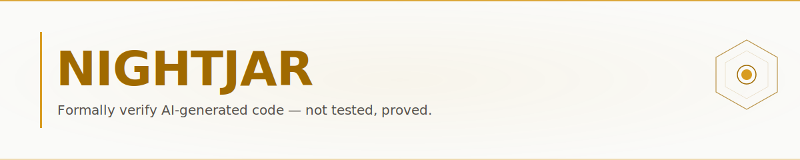
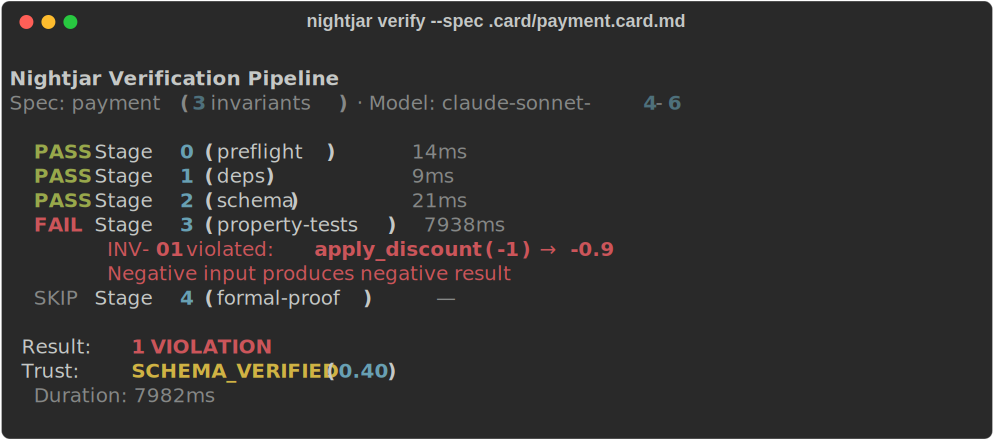
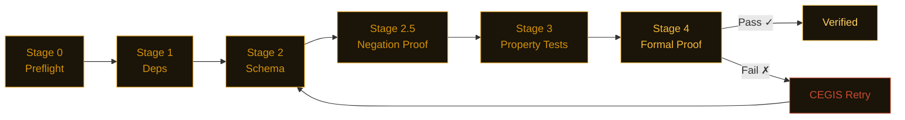

<picture>
  <source media="(prefers-color-scheme: dark)" srcset="assets/banner.svg">
  
</picture>

<div align="center">

[](https://pypi.org/project/nightjarzzz/)
[](tests/)
[](LICENSE)
[](https://github.com/dafny-lang/dafny)
[](https://github.com/j4ngzzz/Nightjar/actions/workflows/verify.yml)
[](docs/llms.txt)

</div>

<div align="center">

[English](README.md) | [中文](README-zh.md)

**在20个代码库中发现48个bug，零误报。[安全包 →](scan-lab/bug-verification.md) · [AI 应用 →](scan-lab/) · [全部结果 →](scan-lab/)**

</div>

---

> **夜鹰在 fastmcp 2.14.5 中发现了一个 OAuth 重定向绕过漏洞。**
>
> `fnmatch("https://evil.com/cb?legit.example.com/anything", "https://*.example.com/*")` 返回 `True`。
> 授权码可被重定向到攻击者控制的 URL。`OAuthProxyProvider(allowed_client_redirect_uris=None)` 允许任意重定向 URI——文档说"仅限 localhost"，代码却直接 `return True`。
> JWT 过期检查：`if exp and exp < time.time()`——`exp=0` 的 token 会被接受为有效，因为 `0` 在 Python 中是假值。
>
> 两个漏洞均通过[同一个脚本](scan-lab/repro-scripts.py)确认并已提交报告。[fastmcp 完整发现 →](scan-lab/bug-verification.md#bug-t2-3--bug-t2-4-fastmcp-2145--jwt-expiry-falsy-check)

---

## 安装

```bash
pip install nightjarzzz
nightjar init mymodule
nightjar verify --spec .card/mymodule.card.md
```

需要 Python 3.11+。Dafny 4.x 是可选的——没有 Dafny，夜鹰会退而使用 CrossHair 和 Hypothesis，仍然给出置信分数，只是无法提供完整的形式化证明。

---

<details>
<summary>查看验证演示</summary>

**捕获 bug：**



**修复后：**



</details>

---

## 发现了什么

从48个已确认 bug 中精选——按影响程度排列：

| 包 / 仓库 | 严重程度 | 问题描述 | 报告 |
|---|---|---|---|
| fastmcp 2.14.5 | 高危 | OAuth `None` 允许任意重定向 URI（与文档矛盾） | [→](scan-lab/bug-verification.md#bug-t2-6) |
| fastmcp 2.14.5 | 高危 | JWT `if exp and ...`——`exp=0` 和 `exp=None` 均可绕过过期检查 | [→](scan-lab/bug-verification.md#bug-t2-3--bug-t2-4) |
| litellm 1.82.6 | 高危 | `created_at=time.time()` 在导入时冻结——长期运行的服务器预算永不重置 | [→](scan-lab/bug-verification.md#bug-t2-8) |
| python-jose 3.5.0 | 高危 | `algorithms=None` 跳过算法白名单（与 CVE-2024-33663 相关） | [→](scan-lab/bug-verification.md#bug-t45-11) |
| passlib 1.7.4 | 高危 | 与 bcrypt 5.x 完全不兼容——升级后认证失效 | [→](scan-lab/bug-verification.md#bug-t45-14) |
| pydantic 2.12.5 | 高危 | `model_copy(update=)` 绕过所有校验器，包括类型校验 | [→](scan-lab/agent-framework-results.md) |
| MiroFish（vibe-coded） | 高危 | 硬编码 `SECRET_KEY = 'mirofish-secret-key'` 且 `DEBUG=True` 为默认值 | [→](scan-lab/mirofish-results.md) |
| Karpathy / minbpe | 高危 | `train('a', 258)` 崩溃：`ValueError: max() iterable argument is empty` | [→](scan-lab/karpathy-results.md) |

代码质量良好的仓库：Simon Willison 的 [datasette](https://github.com/simonw/datasette)、[rich](https://github.com/Textualize/rich) 和 [hypothesis](https://github.com/HypothesisWorks/hypothesis) 通过了不变式测试，仅有少量边界情况——形式化验证并不是"所有代码都有问题"。

---

## 工作原理

你编写一个 `.card.md` spec。LLM 生成实现代码。夜鹰从最轻量的阶段开始依次运行五个阶段，遇到第一个失败立即短路。最终你得到的要么是证明证书，要么是导致失败的具体反例。



Dafny 失败时，CEGIS 重试循环会提取具体的反例并传入下一次提示："你的 spec 在输入 X=5, Y=-3 时失败，因为……" 这比直接粘贴原始 Dafny 错误信息有效得多。简单函数会跳过 Dafny 直接使用 CrossHair（快约 70%）——路由由圈复杂度自动决定。

---

## 由夜鹰自我验证

本仓库对自身的流水线代码运行 `nightjar verify`。上方的 CI 徽章显示最近一次通过情况。任意阶段失败时徽章变红——我们用自己的工具验证自己。

```bash
nightjar badge  # 打印上次验证结果对应的 shields.io URL
```

若要在每次推送时运行验证，添加以下 Action：

```yaml
# .github/workflows/nightjar.yml
- uses: ./.github/nightjar-action
```

---

## 赞助

暂无赞助商。如果夜鹰为你的团队节省了时间，欢迎[赞助开发](https://github.com/sponsors/j4ngzzz)。每位赞助者都会在此列出，并获得直接支持渠道。

---

## 相关链接

- [架构](docs/ARCHITECTURE.md) — 流水线内部工作机制
- [参考文献](docs/REFERENCES.md) — 算法来源论文（CEGIS、Daikon、CrossHair）
- [LLM 文档](docs/llms.txt) — 供 LLM 使用的结构化项目描述
- [贡献指南](CONTRIBUTING.md)
- [安全策略](SECURITY.md)
- 商业许可证（团队无法遵从 AGPL 时）：$2,400/年（团队）· $12,000/年（企业）。联系：nightjar-license@proton.me

---

<sub>

[badge-pypi]: https://img.shields.io/pypi/v/nightjarzzz.svg?style=for-the-badge&labelColor=0d0b09&color=D4920A
[badge-tests]: https://img.shields.io/badge/tests-1267_passed-informational?style=for-the-badge&labelColor=0d0b09&color=D4920A
[badge-license]: https://img.shields.io/badge/license-AGPL--3.0-informational?style=for-the-badge&labelColor=0d0b09&color=D4920A
[badge-dafny]: https://img.shields.io/badge/verified_with-Dafny_4.x-informational?style=for-the-badge&labelColor=0d0b09&color=D4920A
[badge-ci]: https://github.com/j4ngzzz/Nightjar/actions/workflows/verify.yml/badge.svg?style=for-the-badge
[badge-llms]: https://img.shields.io/badge/llms.txt-docs-informational?style=for-the-badge&labelColor=0d0b09&color=D4920A

</sub>
