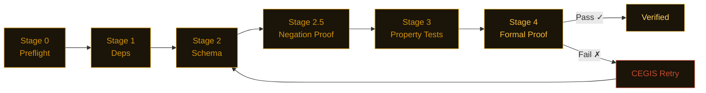

<picture>
  <source media="(prefers-color-scheme: dark)" srcset="assets/banner.svg">
  <source media="(prefers-color-scheme: light)" srcset="assets/banner-light.svg">
  
</picture>

<div align="center">

[](https://pypi.org/project/nightjar-verify/)
[](tests/)
[](LICENSE)
[](https://github.com/dafny-lang/dafny)
[](https://github.com/j4ngzzz/Nightjar/actions/workflows/verify.yml)
[](docs/llms.txt)

[English](README.md) | [中文](README-zh.md)

</div>

---

> **fastmcp 2.14.5 — OAuth 授权码可被重定向至攻击者控制的 URL。**
>
> `fnmatch("https://evil.com/cb?legit.example.com/anything", "https://*.example.com/*")` 返回 `True`。
> `OAuthProxyProvider(allowed_client_redirect_uris=None)` 允许任意重定向 URI——文档声称仅限 localhost。
> JWT 过期检查：`if exp and exp < time.time()`——`exp=0` 是 Unix 纪元时间，因为 `0` 在 Python 中是假值所以被当作有效 token。
>
> 两处漏洞均通过[同一脚本](scan-lab/repro-scripts.py)确认。[完整发现 →](scan-lab/bug-verification.md#bug-t2-3--bug-t2-4-fastmcp-2145--jwt-expiry-falsy-check)

---


---

## 安装

```bash
pip install nightjar-verify
nightjar init mymodule
nightjar verify --spec .card/mymodule.card.md
```

需要 Python 3.11+。Dafny 4.x 是可选的——没有 Dafny，夜鹰会退而使用 CrossHair 和 Hypothesis，仍然给出置信分数。

---

## 发现了什么

在 20 个代码库中确认了 48 个 bug。每个发现都可通过[同一脚本](scan-lab/repro-scripts.py)复现。

---

**fastmcp 2.14.5 — `exp=0` 和 `exp=None` 的 JWT token 被接受为有效**

`fastmcp/server/auth/jwt_issuer.py:215`

```python
if exp and exp < time.time():   # exp=None → False。exp=0 → False。
    raise JoseError("expired")
# 1970 年的 token 或无过期时间的 token 均无报错通过
```

任何缺少过期时间或过期时间为零的 bearer token 都会被静默接受。[详情 →](scan-lab/bug-verification.md#bug-t2-3--bug-t2-4)

---

**litellm 1.82.6 — 长期运行的服务器上预算窗口永不重置**

`litellm/budget_manager.py:81`

```python
def create_budget(
    total_budget: float,
    user: str,
    duration: Optional[...] = None,
    created_at: float = time.time(),  # 在模块导入时计算一次，之后不再更新
):
```

在任何运行超过预算窗口时长的服务器上，每个新预算都会被立即认为已过期，日限额永久失效。[详情 →](scan-lab/bug-verification.md#bug-t2-8)

---

**python-jose 3.5.0 — `algorithms=None` 接受任意签名算法**

`jose/jws.py`

```python
if algorithms is not None and alg not in algorithms:  # None 完全跳过检查
    raise JWSError("The specified alg value is not allowed")
```

与 CVE-2024-33663 相关。传入 `algorithms=None` 会解码任意算法签名的 token，包括非预期算法。[详情 →](scan-lab/bug-verification.md#bug-t45-11)

---

**minbpe — `train('a', 258)` 抛出 `ValueError` 崩溃**

`minbpe/basic.py:35` — Andrej Karpathy BPE 分词器参考实现中的崩溃

```python
pair = max(stats, key=stats.get)  # ValueError: max() iterable argument is empty
# 一行修复：
if not stats:
    break
```

短文本、重复输入，或任何请求合并次数超过文本实际可合并次数的 `vocab_size`——均会崩溃。[详情 →](scan-lab/karpathy-results.md)

---

**MiroFish — 默认配置中存在硬编码密钥和可 RCE 的调试模式**

`backend/app/config.py:24-25`

```python
SECRET_KEY = os.environ.get('SECRET_KEY', 'mirofish-secret-key')  # 公开已知的字面值
DEBUG = os.environ.get('FLASK_DEBUG', 'True').lower() == 'true'   # Werkzeug PIN 绕过
```

任何没有 `.env` 文件的部署都会以公开已知的会话签名密钥和 Flask 交互式调试器运行。[详情 →](scan-lab/mirofish-results.md)

---

**open-swe — 安全兜底中间件在工具失败时静默跳过 PR 恢复**

`agent/middleware/open_pr.py:87`

```python
if "success" in pr_payload:   # success=False 时同样为 True——该键始终存在
    return None               # 无论结果如何，一律放弃恢复
```

当 `commit_and_open_pr` 失败时，本应重试的中间件什么都不做。agent 结束时没有 PR，也没有错误提示。[详情 →](scan-lab/openswe-results.md)

---

### 干净的代码库——规范编写的代码是什么样的

并非所有代码库都有 bug。以下代码库通过验证，零违规：

| 包 | 函数扫描数 | 结果 |
|---------|------------|------|
| `datasette` 0.65.2 | 1,129 | 干净——多层 SQL 注入防御，全程参数化查询 |
| `sqlite-utils` 3.39 | ~237 | 干净——标识符转义一致，无字符串拼接 SQL |
| `rich` 14.3.3 | ~705 | 干净——标记转义正确，所有边界情况均处理 |
| `hypothesis` 6.151.9 | — | 干净——未发现不变式违规 |

夜鹰发现的是代码声称能做的事和实际做到的事之间的差距。这些代码库的差距很小。

---

## 为什么不直接用……

| 工具 | 能检测什么 | 检测不到什么 |
|------|-----------|------------|
| mypy | 类型错误 | 逻辑 bug、边界情况、不变式违规 |
| bandit | 已知漏洞模式 | 新型逻辑缺陷、spec 违规 |
| pytest | 你写了测试的情况 | 你没想到要测试的情况 |
| **Nightjar** | 基于 spec 的数学证明 | 需要先编写 spec |

夜鹰不替代以上任何工具。它检查的是：对于所有输入，代码是否满足你在 spec 中写下的属性——而不仅仅是你想到的那些输入。

---

## 工作原理

你编写一个 `.card.md` spec。LLM 生成实现代码。夜鹰从最轻量的阶段开始依次运行五个阶段，遇到第一个失败立即短路。



Dafny 失败时，CEGIS 重试循环会提取具体的反例并传入下一次提示。简单函数会跳过 Dafny 直接使用 CrossHair（快约 70%）——路由由圈复杂度自动决定。

---

## 由夜鹰自我验证

本仓库对自身的流水线代码运行 `nightjar verify`。验证流水线本身在 `.card/` 中有对应的 spec。如果夜鹰自身的代码违反了某个属性，夜鹰自身的 CI 就会失败。上方 CI 徽章显示最近一次通过情况。

```bash
nightjar badge  # 打印上次验证结果对应的 shields.io URL
```

---

## 赞助

暂无赞助商。如果夜鹰为你的团队节省了时间，欢迎[赞助开发](https://github.com/sponsors/j4ngzzz)。每位赞助者都会在此列出，并获得直接支持渠道。

---

## 相关链接

- [架构](docs/ARCHITECTURE.md) — 流水线内部工作机制
- [参考文献](docs/REFERENCES.md) — 算法来源论文（CEGIS、Daikon、CrossHair）
- [LLM 文档](docs/llms.txt) — 供 LLM 使用的结构化项目描述
- [贡献指南](CONTRIBUTING.md) · [安全策略](SECURITY.md)
- 商业许可证（团队无法遵从 AGPL 时）：$2,400/年（团队）· $12,000/年（企业）。联系：nightjar-license@proton.me
