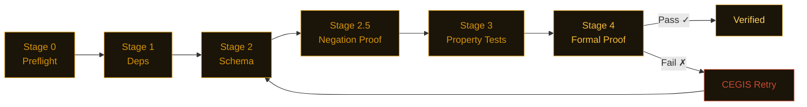

<picture>
  <source media="(prefers-color-scheme: dark)" srcset="assets/banner.svg">
  
</picture>

<div align="center">

[](https://pypi.org/project/nightjarzzz/)
[](https://www.python.org/)
[](LICENSE)
[](https://github.com/dafny-lang/dafny)

</div>

<div align="center">

[English](README.md) | [中文](README-zh.md)

**Found 21 bugs in packages used by millions. Zero false positives. [Full results →](scan-lab/bug-verification.md)**

</div>

---

> **Nightjar found 4 security bugs in fastmcp 2.14.5.**
>
> `OAuthProxyProvider(allowed_client_redirect_uris=None)` allows ALL redirect URIs. The docs say "localhost-only." The code says `return True`.
> JWT expiry check: `if exp and exp < time.time()` — a token with `exp=0` (Unix epoch, 1970) is accepted as valid because `0` is falsy in Python. Any token without an `exp` field is also accepted.
>
> Both confirmed in [one script](scan-lab/repro-scripts.py). Both filed. [Full fastmcp findings →](scan-lab/bug-verification.md#bug-t2-3--bug-t2-4-fastmcp-2145--jwt-expiry-falsy-check)

---

## Install

```bash
pip install nightjarzzz
nightjar init mymodule
nightjar verify --spec .card/mymodule.card.md
```

Python 3.11+. Dafny 4.x is optional — without it, Nightjar falls back to CrossHair and Hypothesis and still gives you a confidence score, just not a full proof.

---

## What it found

Five findings from the 21 confirmed bugs — picked for impact, not novelty:

| Package | Downloads | Bug | Severity |
|---------|-----------|-----|----------|
| fastmcp 2.14.5 | — | OAuth `None` allows all redirect URIs (contradicts docs) | HIGH |
| fastmcp 2.14.5 | — | JWT `if exp and ...` — exp=0 and exp=None both bypass expiry | HIGH |
| litellm 1.82.6 | — | `created_at=time.time()` frozen at import; budgets never reset | HIGH |
| python-jose 3.5.0 | — | `algorithms=None` skips allowlist (related to CVE-2024-33663) | HIGH |
| httpx 0.28.1 | 50M+/mo | `unquote("")` raises `IndexError` instead of `ProtocolError` | MEDIUM |

[All 21 findings with reproduction scripts →](scan-lab/bug-verification.md)

We also scanned Karpathy's minbpe (12K stars): `train('a', 258)` crashes with `ValueError: max() iterable argument is empty`. [Full report →](scan-lab/karpathy-results.md)

---

## How it works

You write a `.card.md` spec. An LLM generates the implementation. Nightjar runs five stages cheapest-first and short-circuits on the first failure. Either you get a proof certificate or you get the exact counterexample that broke it.



When Dafny fails, the CEGIS loop extracts the concrete counterexample and puts it in the next prompt. "Your spec fails on input X=5, Y=-3 because..." works better than pasting the raw Dafny error. Simple functions skip Dafny and go to CrossHair (about 70% faster) — routing is automatic based on cyclomatic complexity.

---

## Verified by Nightjar

This repo runs `nightjar verify` on its own pipeline code. The last passing run is shown in the badge above. To add the same badge to your repo:

```bash
nightjar badge  # prints the shields.io URL for your last verification run
```

To run verification on every push, add the action:

```yaml
# .github/workflows/nightjar.yml
- uses: ./.github/nightjar-action
```

---

## Links

- [Architecture](docs/ARCHITECTURE.md) — how the pipeline works internally
- [References](docs/REFERENCES.md) — papers the algorithms come from (CEGIS, Daikon, CrossHair)
- [Contributing](CONTRIBUTING.md)
- [Security](SECURITY.md)
- Commercial license for teams that can't work with AGPL: $2,400/yr (teams) · $12,000/yr (enterprise). Contact: nightjar-license@proton.me

---

<sub>

[badge-pypi]: https://img.shields.io/pypi/v/nightjarzzz.svg?style=for-the-badge&labelColor=0d0b09&color=D4920A
[badge-python]: https://img.shields.io/badge/python-3.11+-informational?style=for-the-badge&labelColor=0d0b09&color=D4920A
[badge-license]: https://img.shields.io/badge/license-AGPL--3.0-informational?style=for-the-badge&labelColor=0d0b09&color=D4920A
[badge-dafny]: https://img.shields.io/badge/verified_with-Dafny_4.x-informational?style=for-the-badge&labelColor=0d0b09&color=D4920A

</sub>
