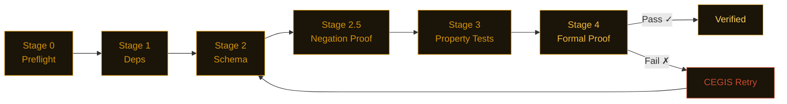

<picture>
  <source media="(prefers-color-scheme: dark)" srcset="assets/banner.svg">
  <source media="(prefers-color-scheme: light)" srcset="assets/banner-light.svg">
  
</picture>

<div align="center">

[](https://pypi.org/project/nightjar-verify/)
[](tests/)
[](LICENSE)
[](https://github.com/dafny-lang/dafny)
[](https://github.com/j4ngzzz/Nightjar/actions/workflows/verify.yml)
[](docs/llms.txt)

[English](README.md) | [中文](README-zh.md)

</div>

---

> **fastmcp 2.14.5 — OAuth authorization codes can be redirected to attacker-controlled URLs.**
>
> `fnmatch("https://evil.com/cb?legit.example.com/anything", "https://*.example.com/*")` returns `True`.
> `OAuthProxyProvider(allowed_client_redirect_uris=None)` allows every redirect URI — the docs say localhost-only.
> JWT expiry check: `if exp and exp < time.time()` — `exp=0` is the Unix epoch and passes because `0` is falsy in Python.
>
> Both confirmed in [one script](scan-lab/repro-scripts.py). [Full findings →](scan-lab/bug-verification.md#bug-t2-3--bug-t2-4-fastmcp-2145--jwt-expiry-falsy-check)

---


---

## Install

```bash
pip install nightjar-verify
nightjar init mymodule
nightjar verify --spec .card/mymodule.card.md
```

Python 3.11+. Dafny 4.x is optional — without it, Nightjar falls back to CrossHair and Hypothesis and still gives you a confidence score.

---

## What it found

48 confirmed bugs across 20 codebases. Every finding runs in [one script](scan-lab/repro-scripts.py).

---

**fastmcp 2.14.5 — JWT tokens with `exp=0` and `exp=None` accepted as valid**

`fastmcp/server/auth/jwt_issuer.py:215`

```python
if exp and exp < time.time():   # exp=None → False. exp=0 → False.
    raise JoseError("expired")
# A token from 1970 or with no expiry passes without error
```

Any bearer token with a missing or zero expiry claim is silently accepted. [Details →](scan-lab/bug-verification.md#bug-t2-3--bug-t2-4)

---

**litellm 1.82.6 — Budget windows never reset on long-running servers**

`litellm/budget_manager.py:81`

```python
def create_budget(
    total_budget: float,
    user: str,
    duration: Optional[...] = None,
    created_at: float = time.time(),  # evaluated once at import, not at call time
):
```

On any server running longer than the budget window, every new budget is immediately treated as expired. Daily limits stop working. [Details →](scan-lab/bug-verification.md#bug-t2-8)

---

**python-jose 3.5.0 — `algorithms=None` accepts any signing algorithm**

`jose/jws.py`

```python
if algorithms is not None and alg not in algorithms:  # None skips the check entirely
    raise JWSError("The specified alg value is not allowed")
```

Related to CVE-2024-33663. Passing `algorithms=None` decodes tokens signed with any algorithm, including unexpected ones. [Details →](scan-lab/bug-verification.md#bug-t45-11)

---

**minbpe — `train('a', 258)` crashes with `ValueError`**

`minbpe/basic.py:35` — a crash in Andrej Karpathy's BPE tokenizer reference implementation

```python
pair = max(stats, key=stats.get)  # ValueError: max() iterable argument is empty
# Fix is one line:
if not stats:
    break
```

Short text, repetitive input, or any `vocab_size` that requests more merges than the text can produce — all crash. [Details →](scan-lab/karpathy-results.md)

---

**MiroFish — Hardcoded secret key and RCE-enabled debug mode in default config**

`backend/app/config.py:24-25`

```python
SECRET_KEY = os.environ.get('SECRET_KEY', 'mirofish-secret-key')  # publicly known
DEBUG = os.environ.get('FLASK_DEBUG', 'True').lower() == 'true'   # Werkzeug PIN bypass
```

Any deployment without a `.env` file runs with a known session signing key and Flask's interactive debugger enabled. [Details →](scan-lab/mirofish-results.md)

---

**open-swe — Safety-net middleware silently skips PR recovery on tool failure**

`agent/middleware/open_pr.py:87`

```python
if "success" in pr_payload:   # True when success=False too — key always present
    return None               # abandons recovery regardless of outcome
```

When `commit_and_open_pr` fails, the middleware that should retry does nothing. The agent ends without a PR and without an error. [Details →](scan-lab/openswe-results.md)

---

### Clean results — what disciplined code looks like

Not every repo has bugs. These passed with no violations:

| Package | Functions scanned | Result |
|---------|------------------|--------|
| `datasette` 0.65.2 | 1,129 | Clean — layered SQL injection defense, parameterized queries throughout |
| `sqlite-utils` 3.39 | ~237 | Clean — consistent identifier escaping, no raw string interpolation |
| `rich` 14.3.3 | ~705 | Clean — markup escape works correctly, all edge cases handled |
| `hypothesis` 6.151.9 | — | Clean — no invariant violations found |

Nightjar finds the gap between what code claims and what it does. These repos have a small gap.

---

## Why not just...

| Tool | What it catches | What it misses |
|------|----------------|----------------|
| mypy | Type errors | Logic bugs, edge cases, invariant violations |
| bandit | Known vulnerability patterns | Novel logic flaws, spec violations |
| pytest | What you write tests for | What you forget to test |
| **Nightjar** | Mathematical proof from specs | Requires writing specs |

Nightjar does not replace any of these. It checks whether the code satisfies the properties you wrote in its spec, for all inputs — not just the inputs you thought of.

---

## How it works

You write a `.card.md` spec. An LLM generates the implementation. Nightjar runs five stages cheapest-first and short-circuits on the first failure.



When Dafny fails, the CEGIS loop extracts the concrete counterexample and puts it in the next prompt. Simple functions skip Dafny and route to CrossHair (about 70% faster) — routing is automatic based on cyclomatic complexity.

---

## Verified by Nightjar

This repo runs `nightjar verify` on its own pipeline code. The verification pipeline has a spec in `.card/`. If Nightjar's own code violates a property, Nightjar's own CI fails. The CI badge above shows the last passing run.

```bash
nightjar badge  # prints the shields.io URL for your last verification run
```

---

## Sponsors

No sponsors yet. If Nightjar saves your team time, consider [sponsoring development](https://github.com/sponsors/j4ngzzz). Every sponsor gets listed here and a direct line for support.

---

## Links

- [Architecture](docs/ARCHITECTURE.md) — how the pipeline works internally
- [References](docs/REFERENCES.md) — papers the algorithms come from (CEGIS, Daikon, CrossHair)
- [LLM docs](docs/llms.txt) — structured project description for LLM consumption
- [Contributing](CONTRIBUTING.md) · [Security](SECURITY.md)
- Commercial license for teams that can't work with AGPL: $2,400/yr (teams) · $12,000/yr (enterprise). Contact: nightjar-license@proton.me

---

## How Nightjar Compares

| Feature | Nightjar | Semgrep | CrossHair | Bandit | mypy |
|---------|----------|---------|-----------|--------|------|
| Formal proofs (Dafny) | ✓ | ✗ | ✗ | ✗ | ✗ |
| Symbolic execution | ✓ | ✗ | ✓ | ✗ | ✗ |
| Property-based testing | ✓ | ✗ | ✓ | ✗ | ✗ |
| Zero-config scanning | ✓ | ✗ | ✗ | ✓ | ✓ |
| AI-native spec format | ✓ | ✗ | ✗ | ✗ | ✗ |
| CEGIS retry loop | ✓ | ✗ | ✗ | ✗ | ✗ |
| CVE-level bug finding | ✓ | ✓ | ✗ | Partial | ✗ |

---

## FAQ

**Can Nightjar verify async/await code?**
Yes. The PBT and schema stages handle async functions. Formal proof via Dafny is limited to pure function equivalents.

**What happens without Dafny installed?**
Nightjar falls back to CrossHair symbolic execution and Hypothesis property testing. You still get 4 of 5 stages.

**How long does verification take?**
Simple functions: 2-5 seconds. Complex modules with formal proof: 30-120 seconds. Use `--fast` to skip Dafny.

**Does Nightjar work with monorepos?**
Yes. Point `nightjar verify --spec .card/module.card.md` at any module.

**Is the AGPL license a problem for commercial use?**
Commercial licenses are available ($2,400/yr teams, $12,000/yr enterprise). See [nightjarcode.dev/pricing](https://nightjarcode.dev/pricing).

---

## Verified Clean Codebases

These popular packages pass all 5 Nightjar stages with zero violations:

- **datasette** — 1,129 functions scanned
- **rich** — ~705 functions scanned
- **hypothesis** — formally verified
- **sqlite-utils** — ~237 functions scanned
