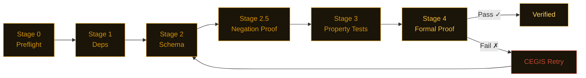

<picture>
  <source media="(prefers-color-scheme: dark)" srcset="assets/banner.svg">
  
</picture>

<div align="center">

[](https://pypi.org/project/nightjarzzz/)
[](tests/)
[](LICENSE)
[](https://github.com/dafny-lang/dafny)
[](https://github.com/j4ngzzz/Nightjar/actions/workflows/verify.yml)
[](docs/llms.txt)

</div>

<div align="center">

[English](README.md) | [中文](README-zh.md)

**Found 48 bugs across 20 codebases. Zero false positives. [Security packages →](scan-lab/bug-verification.md) · [AI apps →](scan-lab/) · [All results →](scan-lab/)**

</div>

---

> **Nightjar found an OAuth redirect bypass in fastmcp 2.14.5.**
>
> `fnmatch("https://evil.com/cb?legit.example.com/anything", "https://*.example.com/*")` returns `True`.
> Authorization codes redirected to attacker-controlled URLs. `OAuthProxyProvider(allowed_client_redirect_uris=None)` allows ALL redirect URIs — the docs say "localhost-only", the code says `return True`.
> JWT expiry check: `if exp and exp < time.time()` — a token with `exp=0` is accepted as valid because `0` is falsy in Python.
>
> Both confirmed in [one script](scan-lab/repro-scripts.py). Both filed. [Full fastmcp findings →](scan-lab/bug-verification.md#bug-t2-3--bug-t2-4-fastmcp-2145--jwt-expiry-falsy-check)

---

## Install

```bash
pip install nightjarzzz
nightjar init mymodule
nightjar verify --spec .card/mymodule.card.md
```

Python 3.11+. Dafny 4.x is optional — without it, Nightjar falls back to CrossHair and Hypothesis and still gives you a confidence score, just not a full proof.

---

<details>
<summary>See verification in action</summary>

**Catching a bug:**


**After fixing:**


</details>

---

## What it found

Selected findings from 48 confirmed bugs — picked for impact:

| Package / Repo | Severity | Bug | Report |
|---|---|---|---|
| fastmcp 2.14.5 | HIGH | OAuth `None` allows all redirect URIs (contradicts docs) | [→](scan-lab/bug-verification.md#bug-t2-6) |
| fastmcp 2.14.5 | HIGH | JWT `if exp and ...` — `exp=0` and `exp=None` both bypass expiry | [→](scan-lab/bug-verification.md#bug-t2-3--bug-t2-4) |
| litellm 1.82.6 | HIGH | `created_at=time.time()` frozen at import — budgets never reset on long-running servers | [→](scan-lab/bug-verification.md#bug-t2-8) |
| python-jose 3.5.0 | HIGH | `algorithms=None` skips allowlist (related to CVE-2024-33663) | [→](scan-lab/bug-verification.md#bug-t45-11) |
| passlib 1.7.4 | HIGH | Completely incompatible with bcrypt 5.x — auth broken on upgrade | [→](scan-lab/bug-verification.md#bug-t45-14) |
| pydantic 2.12.5 | HIGH | `model_copy(update=)` bypasses ALL validators including type validators | [→](scan-lab/agent-framework-results.md) |
| MiroFish (vibe-coded) | HIGH | Hardcoded `SECRET_KEY = 'mirofish-secret-key'` + `DEBUG=True` as defaults | [→](scan-lab/mirofish-results.md) |
| Karpathy / minbpe | HIGH | `train('a', 258)` crashes: `ValueError: max() iterable argument is empty` | [→](scan-lab/karpathy-results.md) |

Clean codebases: Simon Willison's [datasette](https://github.com/simonw/datasette), [rich](https://github.com/Textualize/rich), and [hypothesis](https://github.com/HypothesisWorks/hypothesis) passed invariant tests with only minor edge cases — formal verification is not "everything is broken."

---

## How it works

You write a `.card.md` spec. An LLM generates the implementation. Nightjar runs five stages cheapest-first and short-circuits on the first failure. Either you get a proof certificate or you get the exact counterexample that broke it.



When Dafny fails, the CEGIS loop extracts the concrete counterexample and puts it in the next prompt. "Your spec fails on input X=5, Y=-3 because..." works better than pasting the raw Dafny error. Simple functions skip Dafny and go to CrossHair (about 70% faster) — routing is automatic based on cyclomatic complexity.

---

## Verified by Nightjar

This repo runs `nightjar verify` on its own pipeline code. The CI badge above shows the last passing run. The badge turns red if any stage fails — we eat our own cooking.

```bash
nightjar badge  # prints the shields.io URL for your last verification run
```

To run verification on every push, add the action:

```yaml
# .github/workflows/nightjar.yml
- uses: ./.github/nightjar-action
```

---

## Sponsors

No sponsors yet. If Nightjar saves your team time, consider [sponsoring development](https://github.com/sponsors/j4ngzzz). Every sponsor gets listed here and a direct line for support.

---

## Links

- [Architecture](docs/ARCHITECTURE.md) — how the pipeline works internally
- [References](docs/REFERENCES.md) — papers the algorithms come from (CEGIS, Daikon, CrossHair)
- [LLM docs](docs/llms.txt) — structured project description for LLM consumption
- [Contributing](CONTRIBUTING.md)
- [Security](SECURITY.md)
- Commercial license for teams that can't work with AGPL: $2,400/yr (teams) · $12,000/yr (enterprise). Contact: nightjar-license@proton.me

---

<sub>

[badge-pypi]: https://img.shields.io/pypi/v/nightjarzzz.svg?style=for-the-badge&labelColor=0d0b09&color=D4920A
[badge-tests]: https://img.shields.io/badge/tests-1267_passed-informational?style=for-the-badge&labelColor=0d0b09&color=D4920A
[badge-license]: https://img.shields.io/badge/license-AGPL--3.0-informational?style=for-the-badge&labelColor=0d0b09&color=D4920A
[badge-dafny]: https://img.shields.io/badge/verified_with-Dafny_4.x-informational?style=for-the-badge&labelColor=0d0b09&color=D4920A
[badge-ci]: https://github.com/j4ngzzz/Nightjar/actions/workflows/verify.yml/badge.svg?style=for-the-badge
[badge-llms]: https://img.shields.io/badge/llms.txt-docs-informational?style=for-the-badge&labelColor=0d0b09&color=D4920A

</sub>
